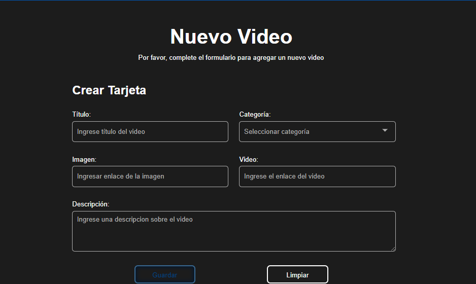
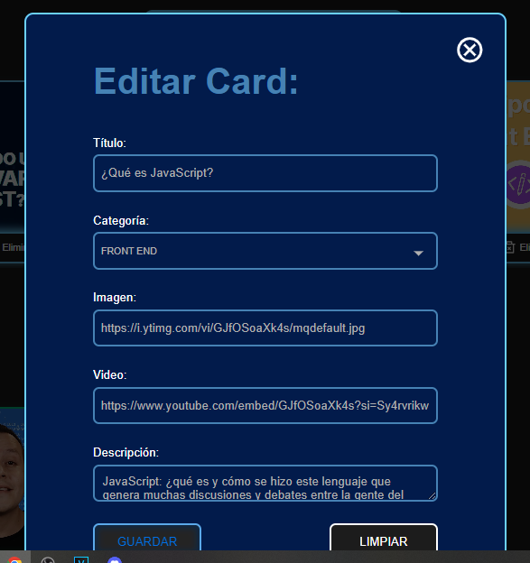

# AluraFlix

Repositorio del challenge AluraFlix, una aplicación web hecha con ayuda de herramientas como React + Vite para mostrar y gestionar videos, de forma similar a la plataforma Netflix.

## Descripción

AluraFlix es una aplicación web diseñada para mostrar una lista de videos y permitir a los usuarios agregar nuevos videos, así como eliminar los existentes. Los usuarios también pueden ver detalles de cada video.

## Características

- Listar videos y agruparlos por categorias
- Agregar, editar y eliminar videos.
- Se pueden editar y/o agregar detalles a los videos tales como el titulo, la descripcion y el thumbnail.

## Tecnologías utilizadas

- HTML
- CSS
- JavaScript
- JSON Server (para simular una API REST)
- Node.JS
- React + Vite

## Uso

- Navega por la lista de videos en la página principal.
- Agrega nuevos videos utilizando el formulario de la sección "Nuevo Video".
- Haz clic en el botón de "eliminar" para eliminar un algun video existente, o en el icono del lapiz para editar algun video existente.

## Capturas de pantalla





## Simulación de API con JSON Server

Para simular una API REST y poder realizar solicitudes HTTP desde la aplicación, es necesario utilizar JSON Server. Asegúrate de tener Node.js instalado en tu máquina para poder ejecutar el servidor de forma local.

Para instalar JSON Server, puedes seguir estos pasos:

1. Abre una terminal en la raíz del proyecto.
2. Ejecuta el siguiente comando para instalar JSON Server globalmente:
   ```
   npm install json-server
   ```
3. Una vez instalado, ejecuta el servidor JSON Server con el siguiente comando:
   ```
   json-server --watch ./database/db.json --port 5000
   ```
   Esto iniciará el servidor en el puerto 5000 y utilizará el archivo `db.json` como base de datos para simular la API.
